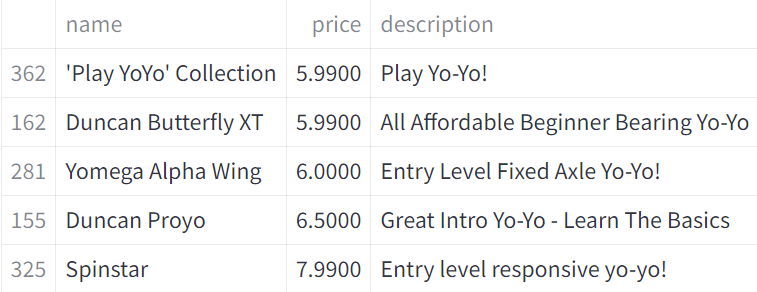
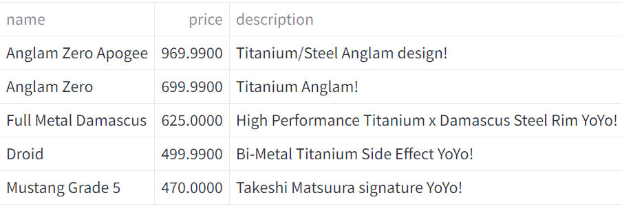
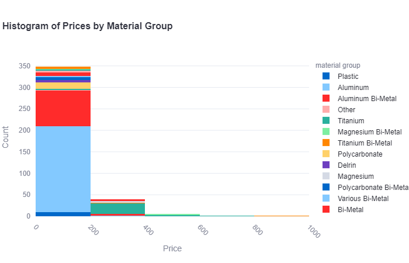
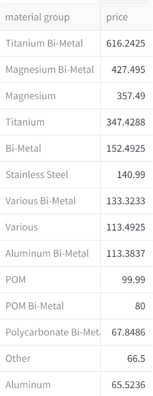
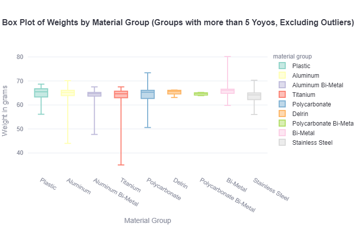
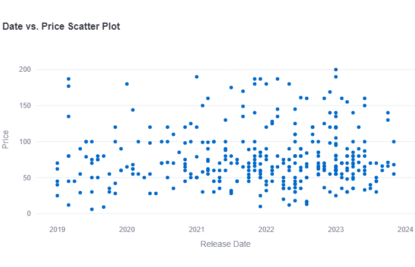
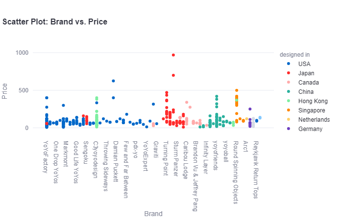
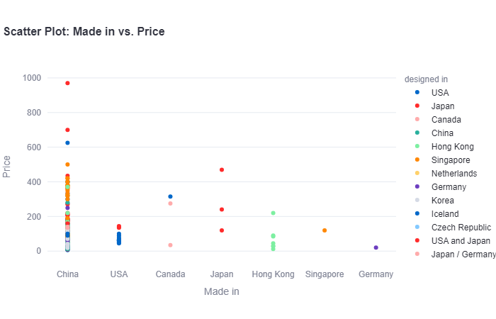
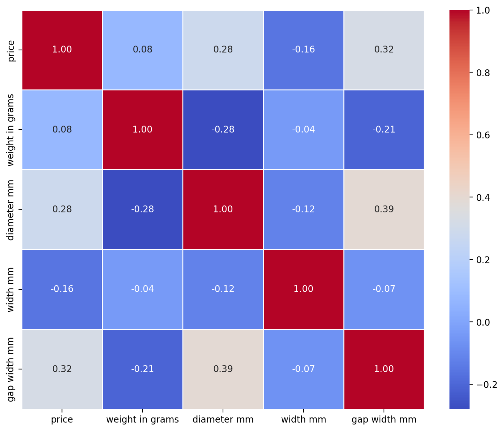

In my [last blog post](https://kadenf17.github.io/2023-12-18-Yoyo-Analysis-Part-1/) I explained how I created a data set describing over 500 different yoyos. In this post, I will explore questions like:
-	What are the most expensive yoyos? (what about by brand?)
-	Does the material have an effect on yoyo price?
-	Do certain manufacturers use better materials in their yoyos?
-	Does one brand of yoyo stand out above the rest?

## Introduction (in case you missed it):

I've spent the last 14 years as a dedicated yoyo enthusiast. I learned to throw as a little kid, and I have kept up with the hobby through the years. Currently, I’m serving as the president of the Yo-Yo Club at BYU. My passion extends beyond personal enjoyment; it's about sharing the thrill with others and contributing to the community.

I have been performing for larger crowds for a couple of years now, and it’s always so fun to see the look on people’s faces when I do crazy tricks! After shows, I usually have a lot of people come up and want to learn how to yoyo. I have a big collection of yoyos, and I always get questions like: What’s your best yoyo? Why are there so many different models? What’s the best yoyo to start out with?

To answer some of these questions, I initiated a data analysis project centered on yoyos. I collected information on over 500 yoyos and looked at different specs including price, material, weight, bearing type, and several other descriptors. The goal is to uncover trends and correlations that can offer insights into the diverse world of yoyos.

## Exploring:

To begin my journey, I wanted to see the most and least expensive yoyos in my data set.

The least expensive yoyos are:

These yoyos are great options for little kids, they are cheap and they probably work pretty well. They are Duncan, Yomega, and YoyoFactory brand yoyos which are all well-known brands.

The most expensive yoyos are:

Wow, $970 is really expensive for a yoyo, but notice the material is Titanium for all of these expensive yoyos. Most yoyo players do not use Titanium yoyos. These are very high end and are not commonly sold. In fact, these yoyos are pretty exclusing and usually sold out. This Titanium trend makes me start to think that material is going to have a big impact on cost. Let’s look and see:

This chart along with the average cost across material group suggests that material does have an impact on cost. It looks like Titanium and Magnesium yoyos are typically the most expensive. I wonder if this has anything to do with the weight of the yoyo. Titanium is heavier than aluminum. Let's investigate!

Most yoyos are about the same weight. The ideal seems to be around 65 grams.

It doesn't seem like material type has a big impact on the weight of the yoyo. This is surprising, I thought titanium yoyos would be heavier. Maybe the cost of the material has more to do with how it's machined and less about weight.

Now, I want to investigate and see if the date has anything to do with the price. Maybe, newer yoyos are more expensive than older ones.

There doesn't seem to be a correlation between Date and Price. It seems like yoyos aren't getting cheaper as they get older. This would indicate that buying a newer yoyo won’t set you back any differently than buying older models. Good to know!

## Discovering Relationships:

I now want to see if I can discover any relationships between the different features in my data. I created a few different graphs using the [Streamlit app](https://yoyoapp.streamlit.app/) I developed using this data. 

The first graph of interest compares brand, price, and where the yoyo was designed in. Take a look:

This plot is interesting because it shows us that most brands are centered around certain countries. We see a lot of yoyos being designed in the USA, Japan, China, and even Canada! This surprised me because I have always thought the USA and Japan always developed the yoyos. It’s cool to know that a good portion are designed in Canada and China.

Another graph similar to this first one shows the price of different yoyos depending on where they were made. The x-axis is where they were made, the y-axis is the price, and the hue is where they were developed.

It’s interesting that most USA made yoyos are under $200. The more expensive models are made in China. It’s not very surprising that the majority of yoyos are made in China because they are the leading manufacturing country in the world.

Let’s now look at a correlation matrix for price, weight, diameter, width, and gap width. I created the heatmap below to help us see if any of these variables are related to each other. I was particularly interested in diameter and width to see if they had anything to do with price.

### Correlation Matrix for price, weight, diameter, width, and gap width:

It looks like gap width (mm) might have the biggest correlation with price, but only a slight one if any. This sadly doesn't show any important relationships.

## In Conclusion:

This dataset helped us answer questions:

Q: What are the most expensive yoyos? (what about by brand?)

    A: Titanium and Magnesium yoyos, regardless of brand.

Q: Does the material have an effect on yoyo price?

    A: Material is a big factor in determining yoyo price

Q: Do certain manufacturers use better materials in their yoyos?

    A: Manufacturers usually make yoyos of all types,
    but the most common type is usually aluminum or aluminum bi-metal.

Q: Does one brand of yoyo stand out above the rest?

    A: Personally, looking at these graphs, I would say that YoyoFactory stands out.
    They have the widest selection of yoyos, and the majority are under $75. 
    They also have high-end titanium yoyos as well if that's what you're looking for.

Thanks for coming on this yoyo analysis journey with me! If you would like to explore the data more, consider checking out my [Streamlit app](https://yoyoapp.streamlit.app/).

Link to my GitHub repository with my code: [Yoyo_Data_Analysis_Project](https://github.com/kadenf17/STAT386_Semester_Project)

